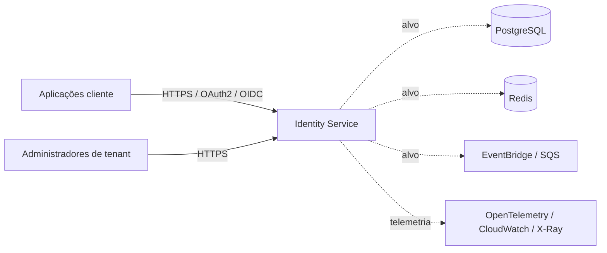

# Diagrama de contexto

```mermaid
flowchart LR
    Client[Aplicações cliente] -->|HTTPS / OAuth2 / OIDC| API[Identity Service]
    Admin[Administradores de tenant] -->|HTTPS| API
    API -. alvo .-> DB[(PostgreSQL)]
    API -. alvo .-> Cache[(Redis)]
    API -. alvo .-> Events[EventBridge / SQS]
    API -. telemetria .-> Observability[OpenTelemetry / CloudWatch / X-Ray]
```

Linhas tracejadas indicam integrações planejadas, ainda não implementadas.
